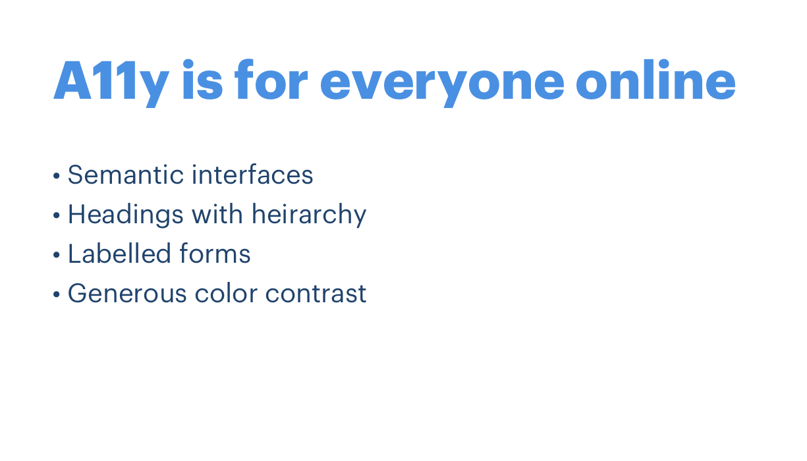

_This project was bootstrapped with [Create React App](https://github.com/facebook/create-react-app). To run the app, run `npm install` and then `npm start`._

# Accessibility Brown Bag: A look into the soul of a screenreader

The following is a transcript from a brown bag, which you can watch [here](https://drive.google.com/file/d/1pp3opkGAhmWkwG1xruptojcqg-rOV8pC/view?usp=sharing).

## Accessibility!


Accessible design is design that can be used by anyone, including people with disabilities. We’re most familiar with accessible interface design, but accessibility is a design tenant that influences everyday objects, too. Like curb cuts in the sidewalk for people who use wheelchairs, or the bumpy yellow textures for people who are blind.

## Terms you may hear


1. **“Accessibility” (a11y for short)** means that everyone who uses the internet can use your software. This includes users with visual, hearing, or motor impairments, and probably others.
2. **The ADA (Americans with Disabilities Act)** provided standards to define what makes a site “accessible”. These standards have different levels of compliance: A, AA, and AAA (low to high). Depending on the software you make, federal regulations require you meet one of these levels.
3. **ARIA (Accessible Rich Internet Applications)** is a set of attributes that define ways to make web content and web applications (especially those developed with JavaScript) more accessible to people with disabilities.

Snapdocs is currently held to AA standards for its consumer-facing experience.

## Accessible things are easier to use, for everyone


Some accessibility requirements improve interfaces for everyone. For example, think about the yellow bumps in the sidewalk. They tell you “this is a safe place to cross the street”. You could figure that out without the yellow bumps, but they make it easier.

## Accessibility for everyone, online



Here’s a real quick rundown of some things that make UIs better for everyone, not just people with disabilities.

* Hierarchy of headings
* Semantic flow of a page
* Labeled form elements
* Generous color contrast

## Today we’re going to talk about screen readers


All of the things I just mentioned are things you can see, but the critical piece of accessibility that we don’t often experience is how our site is conveyed to people without sight. **Enter: the screen reader**.

People with visual impairments use screen readers to read the content of a website aloud. Some common screen readers are:

* Mac VoiceOver
* JAWS
* NVDA

### Using your screenreader
Give it a shot. On Mac, go to System Preferences > Accessibility > Voiceover to find out how to enable it. If you have a Touch Bar, **press Touch ID 3 times while holding Command** to toggle Voiceover.

Now go to a site. You’re surely familiar with using the tab key to go through interactive elements, but the screenreader can traverse every element on the page.

To do this, hold **Command+Option** and click **Right or Left arrows** to traverse elements, **Up or Down arrows** to enter/leave web content, and **Space** to click.

To turn off Voiceover, click the same buttons you used to turn it on.

### How does the screenreader know what to say?
Notice how the screenreader knows to call a link a “Link”, a button a “Button” and so on. And if you navigate away from the browser and open your system preferences, your screenreader knows how to read that information, too. How does this work?

## A brief history of screenreaders


Back when screen readers were first introduced, they had to “look” at the graphics rendered on screen to try to find buttons, links, text, etc. For example, a screen reader might see a box with text inside of it and recognize it as a “button”, and it might check to see if the text is highlighted, indicating that the button is “active”.

This way of reverse-engineering on-screen graphics was obviously error-prone and limited. Different applications might render the same element differently, and the screen reader technology couldn’t “read” new elements until after they shipped.

## A new era: The Accessibility API


In the late 1990s, the first Accessibility API was introduced into operating systems. The Accessibility API is a layer between applications and screen readers what contains useful information about the elements on-screen. It is a language applications use to _tell_ screen readers what’s rendered to the user.

Before Accessibility APIs were introduced, screen readers had to try and decipher an application; but afterwards, the application _itself_ used the Accessibility API to convey what’s on screen in plan, consistent terms. The flow of information looks like this:

Application -> Accessibility API -> Screen reader -> You

This means that in order to make your web app accessible, you just need to know how to talk to the Accessibility API!

## Working with the Accessibility API


In a nutshell, the Accessibility API exposes information about **objects** and the **environment** they live in. For a given object, the accessibility API conveys:

* **Role:** What kind of element is this?
* **Name:** What is its name?
* **State:** If this is an interactive element, what kind of state is it in?

And then it takes all of the objects on the page, and builds an **accessibility tree** which is like a map that the user can navigate.

Let’s step back for a second. This might sound really technical, but we can look at a real-world example of how it works…

## Look at this intersection...


#### Role


It has yellow bumpy strips so it's an intersection.

#### Name


There's a speaker telling me this is "Montgomery and Sutter"

#### State


When I click the button to cross, it says "WAIT" and it chirps at me so I know it's not a safe time to cross yet.

## A more familiar example: a button


```html
<button aria-disabled="true">
  Accept
</button>
```

* **Role:** The `<button>` element conveys the role.
* **Name:** The button's name is implied by its inner-text, "Accept".
* **State:** `aria-disabled` tells the screenreader this button can't be clicked.

## Let’s see it in action


Time to fire up the app!

1. Run `npm install` and then `npm start`. The app will open automatically in your browser at localhost:3000.
2. Navigate to the `/not-accessible` route.
3. Turn your brightness down and try using the app without sight. Notice that it's really difficult!

### Making a11y improvements
This app is riddled with accessibility issues. If we think about fixing it in terms of Roles, Names, and States, we can identify a few improvements.

#### Find things that don’t have the right role
* The heading should be an `<h1>`
* The submit button should be a `<button>` (`<a>` tags tell the user they'll navigate to a new page)

#### Find things that aren’t labelled
* The image needs a description via `alt="description!"`
* The form fields need associated labels, like `<label htmlFor="name">Name</label>`
* The name hint isn't associated with the name field. Add `aria-describedby="hint"` to the field (where "hint" is the id of the hint element).

#### Find things where state isn't conveyed
* When the fields are invalid, add `aria-invalid="true"`
* When an error occurs, set focus to the error heading (via react `ref`s)

See it in the code: [before]('src/components/NotAccessibleApp.js') and [after]('src/components/App.js') all of our a11y fixes!

**To see all of the improvements in action, visit the root url `/`.**

## Conclusion

This was a very high-level overview! Here are some resources to continue learning...

### Tools that make your life easier


* [eslint-plugin-jsx-a11y](https://github.com/evcohen/eslint-plugin-jsx-a11y#readme): Lint rules to catch basic a11y bugs.
* [cypress-axe](https://github.com/avanslaars/cypress-axe#readme): Cypress integration to find a11y issues.
* [Chrome audits](https://developers.google.com/web/tools/chrome-devtools/accessibility/reference): Lets you run an a11y audit in your browser.
* [WAVE accessibility extension](https://wave.webaim.org/): Browser extension with detailed audits.
* [WCAG color contrast checker](https://webaim.org/resources/contrastchecker/): Foreground/background contrast ratios.
* **The PC in our office!** It has IE11, Firefox, and NVDA so you can check out other screenreaders.

### Learning resources


* [Accessibility APIs: A key to web accessibility](https://www.smashingmagazine.com/2015/03/web-accessibility-with-accessibility-api/): Smashing Magazine
* [Accessibility | MDN](https://developer.mozilla.org/en-US/docs/Web/Accessibility)
* [Accessibility – React](https://reactjs.org/docs/accessibility.html)
* [Getting started | UX design | Accessibility for Teams](https://accessibility.digital.gov/ux/getting-started/)

Hopefully, this overview helped you see much this work helps our users with disabilities. If you’re ever stuck, just ask yourself these questions:

1. Are my elements using the appropriate role?
2. Is everything labelled, or has a name?
3. Are the states of my interactive elements exposed to the screenreader?

There are lots of different ways to write accessible code, but as long as you’re orienting around these high-level questions, you’re on the right track!

**And for the record, the cat is Beep! 🐱**
